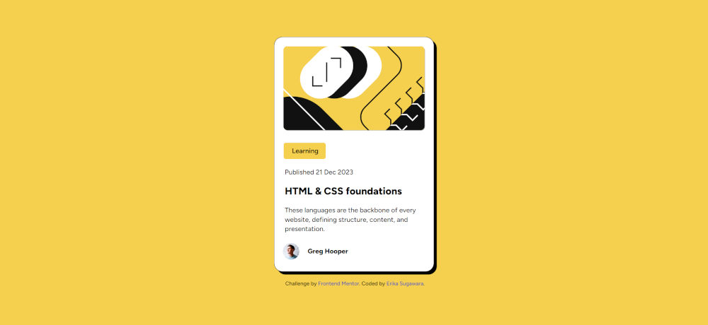

## Menu
 
- [Projetos](#projetos-books)
- [Códigos](#github-code-computer)

## Projetos :books:

<table align="center">
  <tr>
    <td align="center">
       
      <a href="https://erikaestudar.github.io/development/blog-preview-card-main/index.html">Blog Card</a>
    </td>
    <td align="center">
       
      <a href="https://erikaestudar.github.io/development/four-card-feature-section-master/index.html">Four Card Feature</a>
    </td>
    <td align="center">
       
      <a href="https://erikaestudar.github.io/development/product-preview-card-component-main/index.html">Product Card</a>
    </td>
  </tr>
  <tr>
    <td align="center">
       
      <a href="https://erikaestudar.github.io/development/qr-code-component-main/index.html">QR Code Component</a>
    </td>
    <td align="center">
       
      <a href="https://erikaestudar.github.io/development/recipe-page-main/index.html">Recipe Page</a>
    </td>
    <td align="center">
       
      <a href="https://erikaestudar.github.io/development/social-links-profile-main/index.html">Social Links</a>
    </td>
  </tr>
  <tr>
    <td align="center">
       
      <a href="https://erikaestudar.github.io/development/todo-app-main/index.html">To Do app</a>
    </td>
    <td align="center">
      <!-- Pode deixar vazio ou adicionar mais -->
    </td>
  </tr>
</table>

 
### GitHub Code :computer:

- Blog Card: [code](https://github.com/Erikaestudar/development/tree/main/blog-preview-card-main)
- Four Card Feature [code](https://github.com/Erikaestudar/development/tree/main/four-card-feature-section-master)
- Product Card [code](https://github.com/Erikaestudar/development/tree/main/product-preview-card-component-main)
- QR Code Component [code](https://github.com/Erikaestudar/development/tree/main/qr-code-component-main)
- Recipe Page [code](https://github.com/Erikaestudar/development/tree/main/recipe-page-main)
- Social Links [code](https://github.com/Erikaestudar/development/tree/main/social-links-profile-main)
- To Do app [code](https://github.com/Erikaestudar/development/tree/main/todo-app-main)