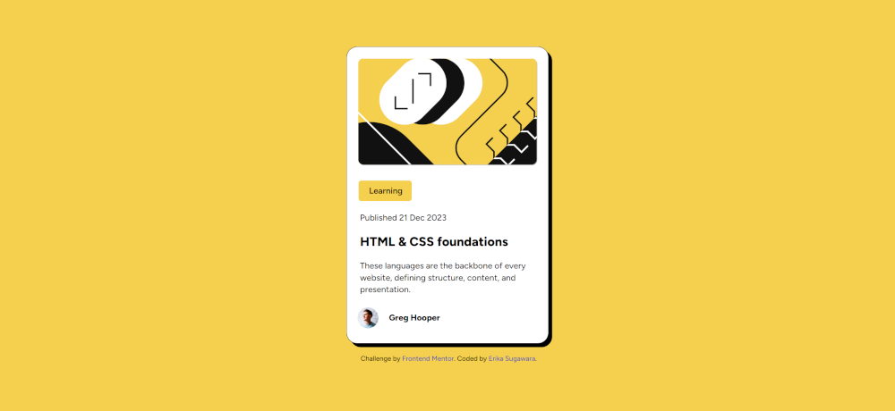

# Frontend Mentor - QR code component solution

This is a solution to the [QR code component challenge on Frontend Mentor](https://www.frontendmentor.io/challenges/qr-code-component-iux_sIO_H). Frontend Mentor challenges help you improve your coding skills by building realistic projects. 

## Table of contents

- [Overview](#overview)
  - [Screenshot](#Screenshot)
  - [Links](#links)
- [My process](#my-process)
  - [Built with](#built-with)
  - [What I learned](#what-i-learned)
  - [Continued development](#continued-development)
  - [Useful resources](#useful-resources)
- [Author](#author)
- [Acknowledgments](#acknowledgments)


## Overview

### Screenshot



### Links

- Solution URL: [GitHub Pages](https://github.com/Erikaestudar/development/tree/main/blog-preview-card-main)
- Live Site URL: [Site](https://erikaestudar.github.io/development/blog-preview-card-main/index.html)

## My process

### Built with

- Semantic HTML5 markup
- CSS custom properties
- Flexbox
- Mobile-first workflow
- Media Query

### What I learned

```css
@font-face {
    font-family: "Figtree";
    src: url("../assets/fonts/Figtree-VariableFont_wght.ttf") format("truetype"), url("../assets/fonts/Figtree-Italic-VariableFont_wght.ttf") format("truetype"), url("../assets/fonts/static/Figtree-Bold.ttf") format("truetype"), url("../assets/fonts/static/Figtree-SemiBold.ttf") format("truetype"), url("../assets/fonts/static/Figtree-ExtraBold.ttf") format("truetype"), ;
}

:root{
    --cor1:hsl(0, 0%, 100%);
    --cor2: hsl(47, 88%, 63%);
    --cor3:hsl(228, 45%, 44%);
    --font: "Figtree", sans-serif;
}
```

### Continued development

I want to continue to improve HTML and CSS more and more, learn JavaScript.

### Useful resources

- [Curso em Video](https://www.youtube.com/c/CursoemV%C3%ADdeo/playlists) - This helped me develop my knowledge.
- [PDF](https://github.com/gustavoguanabara/html-css/tree/master/aulas-pdf) - This is an amazing article which helped me finally understand HTML and CSS. I'd recommend it to anyone still learning this concept.

## Author

- Website - [Erikaestudar](https://erikaestudar.github.io/development/blog-preview-card-main/index.html)
- Frontend Mentor - [@Erikaestudar](https://www.frontendmentor.io/profile/Erikaestudar)

## Acknowledgments

I'm deeply grateful to teacher Guanabara for the course he made available for free on YouTube.
