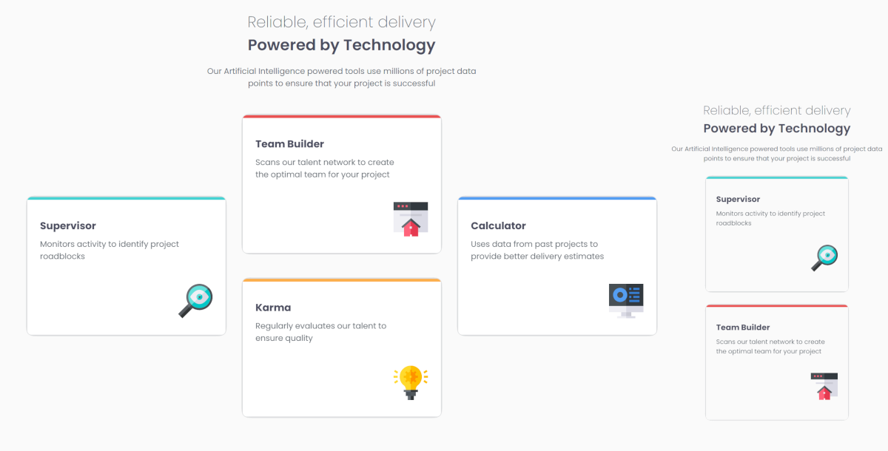

# Frontend Mentor - Four card feature section solution

This is a solution to the [Four card feature section challenge on Frontend Mentor](https://www.frontendmentor.io/challenges/four-card-feature-section-weK1eFYK). Frontend Mentor challenges help you improve your coding skills by building realistic projects. 

## Table of contents

- [Overview](#overview)
  - [Screenshot](#screenshot)
  - [Links](#links)
- [My process](#my-process)
  - [Built with](#built-with)
  - [What I learned](#what-i-learned)
  - [Continued development](#continued-development)
  - [Useful resources](#useful-resources)
- [Author](#author)
- [Acknowledgments](#acknowledgments)


## Overview

### Screenshot



### Links

- Solution URL: [GitHub solution pages](https://github.com/Erikaestudar/development/tree/main/four-card-feature-section-master)
- Live Site URL: [Four Card Feature Section](https://erikaestudar.github.io/development/four-card-feature-section-master/index.html)

## My process

### Built with

- Semantic HTML5 markup
- CSS custom properties
- Flexbox
- CSS Grid
- Mobile-first workflow

### What I learned

```css
@media (width >= 80em) {
  .container {
    display: grid;
    grid-template-columns: repeat(5, 1fr);
    grid-template-areas: 
        ". header header header ."
        ". . card-02 . ."
        ". card-01 card-02 card-04 ."
        ". card-01 card-03 card-04 ."
        ". . card-03 . ."
        ". footer footer footer .";
    justify-items: center;
    align-items: center;
    column-gap: 2rem;
    row-gap: 1rem;
    }
}

```

### Continued development

I want to continue to improve HTML and CSS more and more, learn JavaScript.

### Useful resources

- [Curso em Video](https://www.youtube.com/c/CursoemV%C3%ADdeo/playlists) - This helped me develop my knowledge.
- [Rocketseat](https://www.rocketseat.com.br/).

## Author

- Website - [Erikaestudar](https://github.com/Erikaestudar/development/tree/main/four-card-feature-section-master)
- Frontend Mentor - [@Erikaestudar](https://www.frontendmentor.io/profile/Erikaestudar)

## Acknowledgments

I'm deeply grateful to teacher.
