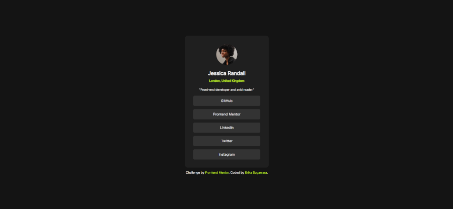

# Frontend Mentor - Social links profile solution

This is a solution to the [Social links profile challenge on Frontend Mentor](https://www.frontendmentor.io/challenges/social-links-profile-UG32l9m6dQ). Frontend Mentor challenges help you improve your coding skills by building realistic projects. 

## Table of contents

- [Overview](#overview)
  - [Screenshot](#Screenshot)
  - [Links](#links)
- [My process](#my-process)
  - [Built with](#built-with)
  - [What I learned](#what-i-learned)
  - [Continued development](#continued-development)
  - [Useful resources](#useful-resources)
- [Author](#author)
- [Acknowledgments](#acknowledgments)


## Overview

### Screenshot



### Links

- Solution URL: [GitHub Pages](https://github.com/Erikaestudar/development/tree/main/social-links-profile-main)
- Live Site URL: [Site](https://erikaestudar.github.io/development/social-links-profile-main/index.html)

## My process

### Built with

- Semantic HTML5 markup
- CSS custom properties
- Flexbox
- Mobile-first workflow
- Media Query

### What I learned

```css
@font-face {
    font-family: "Inter";
    src: url(assets/fonts/static/Inter-Regular.ttf) format("truetype"), url(assets/fonts/static/Inter-SemiBold.ttf) format("truetype"), url(assets/fonts/static/Inter-Bold.ttf) format("truetype"), url(assets/fonts/Inter-VariableFont_slnt\,wght.ttf) format("truetype"),;
}

:root {
    --cor00: hsl(0, 0%, 100%);
    --cor01: hsl(0, 0%, 20%);
    --cor02: hsl(0, 0%, 12%);
    --cor03: hsl(0, 0%, 8%);
    --cor04: hsl(75, 94%, 57%);
    --cor05: hsl(202, 45%, 44%);
    --font: "Inter", sans-serif; 
}

nav {
    display: flex;
    flex-flow: column wrap;
    justify-content: center;
    align-items: center;   
}
```

### Continued development

I want to continue to improve HTML and CSS more and more, learn JavaScript.

### Useful resources

- [Curso em Video](https://www.youtube.com/c/CursoemV%C3%ADdeo/playlists) - This helped me develop my knowledge.
- [PDF](https://github.com/gustavoguanabara/html-css/tree/master/aulas-pdf) - This is an amazing article which helped me finally understand HTML and CSS. I'd recommend it to anyone still learning this concept.

## Author

- Website - [Erikaestudar](https://erikaestudar.github.io/development/social-links-profile-main/index.html)
- Frontend Mentor - [@Erikaestudar](https://www.frontendmentor.io/profile/Erikaestudar)

## Acknowledgments

I'm deeply grateful to teacher Guanabara for the course he made available for free on YouTube.
