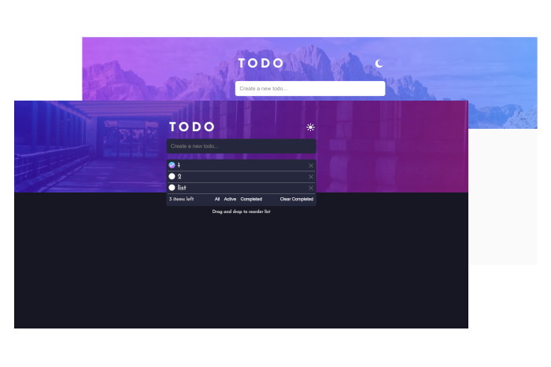

# Frontend Mentor - Todo app solution

This is a solution to the [Todo app challenge on Frontend Mentor](https://www.frontendmentor.io/challenges/todo-app-Su1_KokOW). Frontend Mentor challenges help you improve your coding skills by building realistic projects. 

## Table of contents

- [Overview](#overview)
  - [The challenge](#the-challenge)
  - [Screenshot](#screenshot)
  - [Links](#links)
- [My process](#my-process)
  - [Built with](#built-with)
  - [What I learned](#what-i-learned)
  - [Continued development](#continued-development)
  - [Useful resources](#useful-resources)
- [Author](#author)
- [Acknowledgments](#acknowledgments)

## Overview

### The challenge

Users should be able to:

- View the optimal layout for the app depending on their device's screen size
- See hover states for all interactive elements on the page
- Add new todos to the list
- Mark todos as complete
- Delete todos from the list
- Filter by all/active/complete todos
- Clear all completed todos
- Toggle light and dark mode
- **Bonus**: Drag and drop to reorder items on the list

### Screenshot

### Links

- Solution URL: [GitHub solution pages](https://github.com/Erikaestudar/development/tree/main/todo-app-main)
- Live Site URL: [To-Do site](https://erikaestudar.github.io/development/todo-app-main/index.html)

## My process

### Built with

- Semantic HTML5 markup
- CSS custom properties
- Flexbox
- Mobile-first workflow
- JSON

### What I learned

I learned a lot from this project, I often thought about giving up on it. Because I started studying JavaScript while I was trying to do this. It was a very big challenge for me, between research and studies, the code often didn't work, I used AI for better targeting, and this is the result. A lot of JS code was the first time I came across it, like JSON, drag and drop.

### Continued development

I intend to continue learning more and more.

### Useful resources

- [Example resource 1](https://www.youtube.com/watch?v=MxP4jZQY0h4&t=2783s) - This helped me to make JSON.

## Author

- Website - [Erikaestudar](https://erikaestudar.github.io/development/social-links-profile-main/index.html)
- Frontend Mentor - [@Erikaestudar](https://www.frontendmentor.io/profile/Erikaestudar)

## Acknowledgments

I thank my husband who listened to me complain about this project, and never asked me to give up on it since it was so difficult for my level.😂
